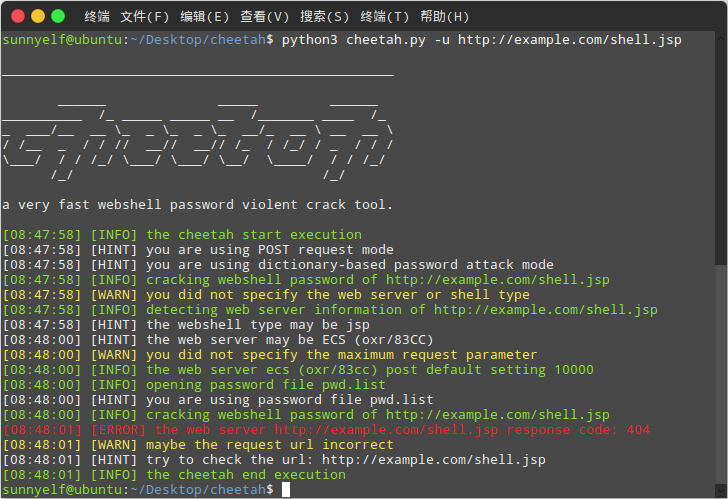
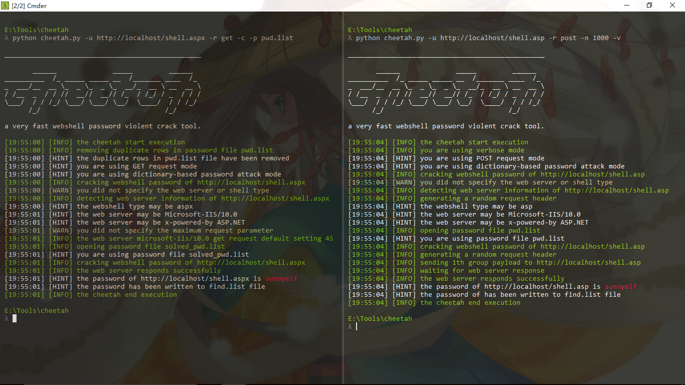

[English description](README.md) | [中文说明](README_zh.md)

 

# 0x00 cheetah

Cheetah is a dictionary-based brute force password webshell tool, running as fast as a cheetah hunt for prey. 

Cheetah's working principle is that it can submit a large number of detection passwords based on different web services at once, blasting efficiency is thousands of times other common brute force password webshell tools.

# 0x01 features

* Fast speed.

* Support python 2.x and python 3.x

* Support to read large password dictionary file.

* Support to remove duplicate passwords of large password dictionary file.

* Support for automatic detection of web services.

* Support brute force batch webshell urls password.

* Support for automatic forgery request header.

* Currently support php, jsp, asp, aspx webshell.

# 0x02 parameter description

python cheetah.py -h

	_________________________________________________
	       ______              _____         ______
	__________  /_ _____ _____ __  /_______ ____  /_
	_  ___/__  __ \_  _ \_  _ \_  __/_  __ \ __  __ \
	/ /__  _  / / //  __//  __// /_  / /_/ / _  / / /
	\___/  / / /_/ \___/ \___/ \__/  \____/  / / /_/
	      /_/                               /_/
	
	a very fast brute force webshell password tool.
	
	usage: cheetah1.py [-h] [-i] [-v] [-c] [-up] [-r] [-w] [-s] [-n] [-u] [-b]
	                   [-p [file [file ...]]]
	
	optional arguments:
	  -h, --help            show this help message and exit
	  -i, --info            show information of cheetah and exit
	  -v, --verbose         enable verbose output(default disabled)
	  -c, --clear           clear duplicate password(default disabled)
	  -up, --update         update cheetah
	  -r , --request        specify request method(default POST)
	  -t , --time           specify request interval seconds(default 0)
	  -w , --webshell       specify webshell type(default auto-detect)
	  -s , --server         specify web server name(default auto-detect)
	  -n , --number         specify the number of request parameters
	  -u , --url            specify the webshell url
	  -b , --url-file       specify batch webshell urls file
	  -p file [file ...]    specify possword file(default data/pwd.list)
	
	use examples:
	  python cheetah.py -u http://orz/orz.php
	  python cheetah.py -u http://orz/orz.jsp -r post -n 1000 -v
	  python cheetah.py -u http://orz/orz.asp -r get -c -p pwd.list
	  python cheetah.py -u http://orz/orz -w aspx -s iis -n 1000
	  python cheetah.py -b url.list -c -p pwd1.list pwd2.list -v

# 0x03 screenshot

## Ubuntu

## Windows

# 0x03 download and use and update cheetah #

	git clone https://github.com/sunnyelf/cheetah.git
	python cheetah.py 
	git pull orgin master

# 0x04 files description #

	cheetah:
	│  .codeclimate.yml
	│  .gitignore
	│  .travis.yml
	│  cheetah.py              mian program
	│  LICENSE
	│  README.md
	│  README_zh.md
	│  update.py               update module
	│
	├─data 
	│      big_shell_pwd.7z   big shell password file
	│      pwd.list           default shell password file
	│      url.list           default batch webshell urls file
	│      user-agent.list    user agent file
	│
	└─images
	        1.png
	        2.png
	        3.png
	        4.png
	        logo.jpg
